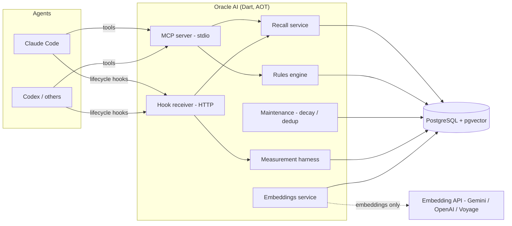

<div align="center">

# Oracle AI

**A long-term memory bank for AI coding agents — backed by PostgreSQL + pgvector, exposed over MCP.**

[](LICENSE)
[](https://dart.dev)
[](https://github.com/pgvector/pgvector)
[](https://modelcontextprotocol.io)

</div>

---

Oracle AI gives coding agents (Claude Code, Codex, Cursor, …) a **persistent, queryable memory** that survives
across sessions and context compaction. Instead of re-discovering the same facts every session — re-reading
files, re-deriving decisions, re-learning project rules — an agent **recalls** the relevant slice on demand and
**saves** durable learnings as it works.

It is the engineering realization of Andrej Karpathy's **"LLM Wiki"** idea: a curated knowledge base that the
model reads from and writes to, so knowledge **accumulates** instead of evaporating at the end of each chat.

## Table of contents

- [Why](#why)
- [The five pillars](#the-five-pillars)
- [Architecture](#architecture)
- [Project structure](#project-structure)
- [Data model](#data-model)
- [MCP tool surface](#mcp-tool-surface)
- [Agent integration (Claude Code / Codex)](#agent-integration-claude-code--codex)
- [Teaching your agent to use Oracle](#teaching-your-agent-to-use-oracle)
- [Quick start](#quick-start)
- [Configuration](#configuration)
- [Run modes & production](#run-modes--production)
- [Measurement harness](#measurement-harness)
- [Tech stack](#tech-stack)
- [Status & roadmap](#status--roadmap)
- [Documentation](#documentation)
- [Contributing](#contributing)
- [License](#license)

## Why

LLMs are stateless between sessions. Agent harnesses paper over this with a static instructions file
(`CLAUDE.md` & co.) that is loaded in full every session, and with **context compaction** — a lossy
summarization that fires when the window fills up, discarding the live history (exact tool outputs, reasoning,
decisions) in exchange for a prose summary.

Both have limits: the static file does not scale to a large, multi-repo knowledge base, and compaction
*provably loses* context the agent still needed. Oracle AI addresses this with an **external memory** that:

- **persists verbatim and consolidated** what compaction throws away;
- **recalls semantically** the relevant slice for the current task (not everything, every turn);
- **spans an ecosystem** of repositories, not a single folder;
- enforces **rules with adherence**, injected automatically;
- is **shared across agents**, so what one agent learns, the next one knows.

## The five pillars

1. **Embeddings brain** — semantic recall over a hybrid (vector + full-text) index, not keyword grep.
2. **Force recall** — deep, structured retrieval the agent can lean on instead of re-deriving context.
3. **Ecosystem memory** — a `product → project` hierarchy so memory and rules span many repositories, with
   inheritance and override.
4. **Persistent rules engine** — development rules with `severity` and `priority`, resolved per task and
   injected so agents actually follow them.
5. **Corporate memory** — one shared store, so knowledge compounds across agents and sessions.

## Architecture

Clean Architecture + DDD (layers `domain ← infra ← external`), a Dart **pub workspace**, `auto_injector` for
DI, compiled to a native **AOT** binary. One relational + vector store (PostgreSQL + pgvector) holds everything.



- **MCP server (stdio)** — the on-demand tool surface (save / recall / rules / maintenance / metrics).
- **Hook receiver (HTTP)** — speaks the agent host's **hook protocol**: captures the session automatically and
  **injects** recalled memory at session start and per prompt.
- **Deterministic maintenance** (decay / dedup / supersession) runs server-side **without an LLM**. The only
  external dependency is the embeddings API — and even that is optional (a local, offline embedder ships in).

> **No consolidation LLM.** Memory is consolidated by the **agent itself** (it already has the short-term
> context), via a strict-schema MCP tool. The server only does deterministic, explainable maintenance.

## Project structure

A Dart workspace of four packages:

| Package | Role |
|---|---|
| `oracle_core` | Pure-Dart base: `Database` (PostgreSQL pool), `SqlStatement`/`SqlVector` (pgvector), config, DI (`auto_injector`), value objects, the embeddings service (`local` / `gemini` / `openai` / `voyage`), `result_dart`. |
| `oracle_migration` | Versioned migration system (`v{semver}/{seq}_{name}/{seq}.sql`), SHA-256 checksums, advisory lock with stale-takeover, transactional, forward-fix. Runs on startup. |
| `oracle_memory` | The domain — **9 DDD feature slices**, each `domain / infra / external` + a DI module. |
| `oracle_server` | Entrypoint + MCP server + hook receiver + recall service + maintenance scheduler + install generators. |

The nine slices in `oracle_memory`:

| Slice | What it owns |
|---|---|
| `product` | The ecosystem scope above projects (cross-repo). |
| `project` | The central scope unit; resolve-or-create by **git root** (`cwd → projectId`). |
| `architecture` | Project architecture pages, versioned per `area`, hybrid search, retire. |
| `rule` | Development rules: `severity` + `priority`, product→project inheritance/override, `rules_for_task`, hybrid search, set-priority, retire. |
| `memory` | Consolidated memory (tiers `episodic`/`semantic`/`procedural`, kinds, importance), hybrid search (RRF), supersession, forget, distance-gated recall. |
| `capture` | Raw capture, hook-driven: `Project → Session` (the agent's own session id) `→ Request` (one per user prompt, embedded) `→ Messages` (the agent's work). Searchable request history. |
| `handoff` | Continuity baton across sessions/agents (summary, open questions, next steps). |
| `maintenance` | Deterministic sweep (decay + dedup), lint, no LLM. |
| `metrics` | Measurement harness: per-session token & compaction metrics, A/B by label. |

Every slice follows the same shape: immutable **entity** + value objects → **repository** interface
(`ResultDart`) → **usecases** → **datasource** interface → DB datasource (parameterized `SqlStatement`) +
mapper → **DI module**.

## Data model

PostgreSQL + pgvector, embeddings as `vector(1024)`, HNSW indexes for vector recall, `tsvector`/GIN for
full-text, hybrid search fused with **Reciprocal Rank Fusion (RRF, k=60)**. Eleven tables across four
forward-only migrations:

| Migration | Adds |
|---|---|
| `v1.0.0` baseline | `products`, `projects`, `architectures`, `rules`, `sessions`, `requests`, `messages`, `agent_events`, `memories`, `handoffs` + pgvector + HNSW/GIN indexes. |
| `v1.1.0` mutation layer | `rules.priority`; `retired_at`/`retired_reason` on `rules`/`architectures`/`memories` (soft retire + audit). |
| `v1.2.0` project resolve | unique index on `projects.repo_path` (race-safe cwd → project upsert). |
| `v1.3.0` metrics | `session_metrics` (the measurement harness). |

Lifecycle is **versioned, not destructive**: rules/architecture/memory are *superseded* (kept as history) or
*retired* (soft, audited) — with an explicit *purge* for true deletion. Three orthogonal axes keep concerns
separate: **severity** (obligation), **priority** (ranking), **lifecycle** (active / superseded / retired).

## MCP tool surface

**32 tools**, each wired to a usecase via DI. Highlights:

- **Scope** — `oracle_product_register/list`, `oracle_project_register/list/resolve`.
- **Knowledge** — `oracle_architecture_save/get/search/retire`, `oracle_rule_save/rules_for_task/search/set_priority/retire`.
- **Memory** — `oracle_memory_save/search/get/forget`.
- **Continuity** — `oracle_handoff_begin/pending/accept`, `oracle_session_recent/history/requests`, `oracle_request_messages/search`.
- **Maintenance** — `oracle_maintenance_run` (decay + dedup, with `dryRun`), `oracle_maintenance_lint`.
- **Measurement** — `oracle_metrics_summary`, `oracle_metrics_session`.

The server also advertises static **MCP `instructions`** (auto-injected once by the client) that tell the agent
how to use Oracle — standing guidance at ~zero per-turn cost.

## Agent integration (Claude Code / Codex)

Oracle speaks the agent host's native seams, so it both **captures** the session and **injects** recall:

Capture mirrors how agents work: a **session** is the agent's own session (no lifecycle); each prompt opens a
**request** (the user's demand); the agent's work is the **messages** under it — `Session → Request → Messages`.

- **Inject** (synchronous hook responses):
  - **SessionStart** → the *session identity* (so it can be resumed) + a stable *session brief* (pending
    handoff + required rules + top memories).
  - **UserPromptSubmit** → opens the **request** and returns a **distance-gated** recall (nothing injected when
    nothing is relevant — no noise, no prompt-cache churn).
- **Capture** (fire-and-forget):
  - **Stop** → the assistant turn (a message under the latest request) + its token usage (for metrics).
  - **PostToolUse** → the tool call as a message · **PostCompact** → the compaction summary becomes a memory.

Sessions have **no status** — there is nothing to close on `SessionEnd`. The project is resolved from the
hook's `cwd`, canonicalized to the **git root**, so subdirectories and worktrees map to one project. Wiring is
generated for you:

```bash
oracle_ai install-mcp /path/to/oracle_ai   # prints the .mcp.json snippet
oracle_ai install-hooks                     # prints the settings.json hooks block
```

> **Cost-aware by design.** Recall is injected at a *stable* position (session start) or *gated* by relevance,
> never as a per-turn-varying tail — so it does not trade a cheap cached prefix for expensive cache misses.

## Teaching your agent to use Oracle

With the hooks installed, the SessionStart brief and the standing MCP `instructions` are injected
automatically — so on a fully wired host much of this happens for you. To make the workflow **explicit and
portable across hosts**, drop the protocol below into your agent's instruction file. It is the contract that
turns the tools into a habit: *recall before you re-derive, record what's durable, hand off what's open.*

**Where it goes** (all three also auto-load the MCP `instructions` over MCP):

| Host | Instruction file |
|---|---|
| Claude Code | `CLAUDE.md` (or `.claude/rules/oracle.md`) |
| Codex | `AGENTS.md` |
| opencode | `AGENTS.md` |

**The protocol — copy this into the file above:**

```markdown
# Oracle AI — long-term memory protocol

You have a persistent memory bank for this codebase, exposed as the `oracle_*` MCP tools.
Treat it as your long-term memory: recall before you re-derive, and record durable learnings as you go.
Prefer recalled facts over re-reading files; trust but verify (memory can be stale — re-check before acting
on a claim that names a specific file, symbol, or value).

## Start of a task
1. Resolve the project — call `oracle_project_resolve` with the absolute repo path (your cwd). Reuse the
   returned `projectId` for every other call this session.
2. Load the rules — call `oracle_rules_for_task` (projectId, optional scope). Treat `required` rules as
   mandatory and `recommended` as strong defaults.
3. Recall context — before exploring, `oracle_memory_search` and `oracle_architecture_get` / `_search` for
   what's relevant to the task. If the request feels familiar, `oracle_request_search` finds past user demands
   like it; `oracle_request_messages` then shows how each was handled.

> Capture is automatic — hooks record your session, each user request, and your work as
> `Session → Request → Messages`. You never log them by hand; just consolidate durable memories (below).

## While working
- Save a durable, non-obvious learning the moment you have one, with `oracle_memory_save`:
  - `tier`: `episodic` (this task) · `semantic` (lasting knowledge) · `procedural` (a how-to)
  - `kind`: `decision` · `gotcha` · `rule` · `fact`
  - `title`: a short, searchable headline · `body`: the fact **and why it matters**
  - `importance`: 0..1 (higher = more central)
- Create or refine a rule with `oracle_rule_save` (`key`, `scope`, `title`, `content`,
  `severity` = required|recommended, `priority` 0..100). Re-saving the same `key` REFINES it (versioned).
- Keep architecture current per area with `oracle_architecture_save`.

## What to save — and what not to
- DO save: decisions + their rationale, gotchas/footguns, conventions, hard-won facts, cross-cutting context.
- DON'T save: anything derivable from the code or git history, transient chatter, secrets, or one-off trivia.
  Bad memory is worse than no memory.
- Fix bad memory: re-save to supersede it, `oracle_memory_forget` it, or `oracle_rule_retire` a dead rule.

## End of a task / before the context window fills up
- Persist the key learnings (above), then write a handoff with `oracle_handoff_begin`
  (`summary`, `openQuestions`, `nextSteps`, `filesTouched`) so the next session continues without re-explaining.
```

**Tool cheat-sheet** (intent → tool):

| When you want to… | Call |
|---|---|
| Map cwd → a stable projectId | `oracle_project_resolve` |
| Get the rules that apply to the task | `oracle_rules_for_task` |
| Recall a past fact / decision / gotcha | `oracle_memory_search` |
| Find a past user demand like this one | `oracle_request_search` → `oracle_request_messages` |
| Read or search the architecture | `oracle_architecture_get` / `oracle_architecture_search` |
| Save a durable learning | `oracle_memory_save` |
| Create or refine a development rule | `oracle_rule_save` |
| Re-rank a rule without a new version | `oracle_rule_set_priority` |
| Hand off open work to the next session | `oracle_handoff_begin` |
| Pick up the previous session's handoff | `oracle_handoff_pending` / `oracle_handoff_accept` |
| Forget wrong / obsolete memory | `oracle_memory_forget` |

## Quick start

Requirements: **Docker** and (to build) **Dart SDK ≥ 3.11**.

```bash
# 1. Start PostgreSQL + pgvector (pick a free host port if 5432 is taken)
ORACLE_DB_PORT=5435 docker compose up -d db

# 2. Configure
cp .env.example .env        # then edit as needed

# 3. Build the native binary
dart pub get
dart compile exe packages/oracle_server/bin/oracle_ai.dart -o build/oracle_ai

# 4. Migrate, then run (all-in-one: MCP over stdio + hook receiver)
./build/oracle_ai migrate
./build/oracle_ai
```

Or run everything in Docker:

```bash
docker compose up --build
```

Then point your agent at it with `install-mcp` / `install-hooks` (see [the runbook](docs/operations.md)).

## Configuration

All via environment variables (`.env` is loaded; process env overrides it). Key settings:

| Variable | Default | Purpose |
|---|---|---|
| `ORACLE_DB_HOST` / `PORT` / `USER` / `PASSWORD` / `NAME` | localhost / 5432 / postgres / postgres / oracle_db | Database connection. |
| `ORACLE_DB_AUTO_CREATE` | `false` | Create the database if missing. |
| `ORACLE_EMBEDDING_PROVIDER` | `local` | `local` (offline) / `gemini` / `openai` / `voyage`. |
| `ORACLE_EMBEDDING_DIM` | `1024` | Must match the schema's `vector(1024)`. |
| `GEMINI_API_KEY` / `OPENAI_API_KEY` / `VOYAGE_API_KEY` | — | For the chosen provider. |
| `ORACLE_HTTP_HOST` / `ORACLE_HTTP_PORT` | 127.0.0.1 / 49500 | Hook receiver endpoint. |
| `ORACLE_MAINTENANCE_ON_STARTUP` | `false` | Run the decay/dedup sweep once on boot. |
| `ORACLE_MAINTENANCE_INTERVAL_MINUTES` | `0` | Run the sweep every N minutes (0 = off). |
| `ORACLE_METRICS_ENABLED` / `ORACLE_METRICS_LABEL` | `true` / `default` | Measurement harness + experiment tag. |

## Run modes & production

The binary has several modes (first matching arg wins):

| Command | Behavior |
|---|---|
| `oracle_ai` | All-in-one: migrate + hook receiver + scheduler + MCP (stdio). |
| `oracle_ai serve-hooks` | **Shared daemon**: migrate + hook receiver + scheduler, runs until SIGINT/SIGTERM. No MCP. |
| `oracle_ai serve-mcp` | MCP (stdio) only — no hooks (the daemon owns them). One per agent. |
| `oracle_ai migrate` | Migrate, then exit. |
| `oracle_ai install-mcp [path]` / `install-hooks` | Print client wiring. |

For multi-agent / shared machines, run **one hooks daemon** and let each agent spawn `serve-mcp`:

```bash
docker compose -f docker-compose.prod.yml up -d --build
```

This brings up the database and the shared `serve-hooks` daemon (hook receiver + scheduler + migrations),
while per-agent MCP processes connect to the same database. See [docs/operations.md](docs/operations.md) §7.

## Measurement harness

To *prove* the cost/quality impact rather than assume it, the hooks feed a `session_metrics` table:
per-session **token usage** (input / output / cache-creation / cache-read), **turns**, **tool uses**, and
**compactions** — accumulated incrementally so a later compaction truncating the transcript never loses data.
Tag runs with `ORACLE_METRICS_LABEL` and compare with `oracle_metrics_summary`:

```sql
SELECT label, count(*) AS sessions,
  round(sum(cache_read_tokens)::numeric
    / NULLIF(sum(input_tokens + cache_creation_tokens + cache_read_tokens), 0), 4) AS cache_read_ratio,
  round(avg(compactions)::numeric, 2) AS avg_compactions_per_session
FROM session_metrics GROUP BY label;
```

The thesis (see [docs/agent-integration.md](docs/agent-integration.md)): for large / multi-repo / long sessions,
external recall **reduces cost** mainly by **avoiding compactions** (each is an expensive summarization call)
and **re-work across sessions**, while raising the cache-read ratio — and **improves quality** by preserving
what compaction loses. The harness lets you verify it on your own workload.

## Tech stack

- **Dart** ≥ 3.11 (pub workspace, AOT binary)
- **PostgreSQL 17 + pgvector** 0.8 (`vector`, HNSW, `tsvector`/GIN, hybrid RRF)
- **MCP** via `mcp_dart` (stdio); **shelf** for the HTTP hook receiver
- `auto_injector` (DI) · `result_dart` (typed results) · `crypto` / `path`
- Clean Architecture + DDD

## Status & roadmap

**Implemented & validated against real pgvector:** the full schema (migrations v1.0.0–v1.3.0), all 9 slices,
32 MCP tools, embeddings (local + Gemini validated), the mutation layer (priority + retire/forget), the
maintenance sweep (decay + dedup + lint + scheduler), multi-agent hardening (port tolerance, migration lock +
stale-takeover, cwd→git-root resolve), the Claude Code integration (hook protocol, inject + capture, MCP
instructions), the measurement harness, and a shared-daemon production topology.

**Next:** run the measurement A/B (`oracle` vs `baseline`) on real workloads to turn the cost thesis into
measured fact; deep-read of the agent transcript; richer per-tool capture; HTTP MCP transport.

## Documentation

In-depth documentation lives in [`docs/`](docs/), organized by purpose:

- **Explanation** — [vision](docs/vision.md), [architecture](docs/architecture.md)
- **Reference** — [data model](docs/data-model.md), [MCP tools](docs/mcp-tools.md)
- **Guides** — [agent integration](docs/agent-integration.md), [operations runbook](docs/operations.md)

## Contributing

Issues and pull requests are welcome. Please keep the architecture boundaries (`domain ← infra ← external`),
write code and comments in **English**, and validate changes against a real PostgreSQL + pgvector instance.

## License

Licensed under the **Apache License 2.0** — see [LICENSE](LICENSE).
