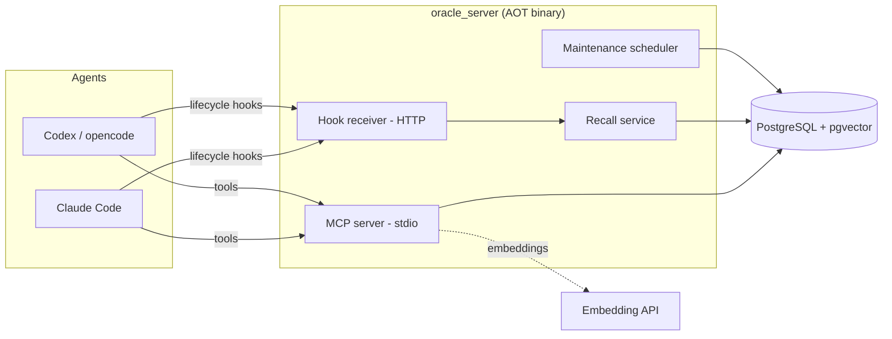

# Architecture

> How Oracle AI is built: layering, packages, feature slices, and runtime topology.

## Clean Architecture + DDD

The codebase follows Clean Architecture combined with DDD, with a strict dependency direction:

```
domain  ←  infra  ←  external
```

- **domain** — entities (immutable) + value objects, repository **interfaces**, use cases, DTOs, typed
  failures. No I/O, no SQL.
- **infra** — datasource **interfaces** (which throw typed failures) and repository **implementations** (which
  catch them and return a `ResultDart`).
- **external** — concrete datasources (parameterized `SqlStatement` against PostgreSQL) and mappers.

Every feature is a **vertical slice** with this exact shape, wired by a DI module (`auto_injector`). Use cases
return `ResultDart<Success, Failure>` — errors are values, not exceptions, across the boundary.

## Packages (Dart workspace)

| Package | Role |
|---|---|
| `oracle_core` | Pure-Dart base: `Database` (PostgreSQL connection pool), `SqlStatement` / `SqlValue` / `SqlVector` (pgvector), `DatabaseConfig`, DI (`injector`, `Module`), value objects (`IdVO`, `TextVO`), typed failures, and the embeddings service. Re-exports `result_dart`. |
| `oracle_migration` | Versioned migration system ported to the project: discovers `v{semver}/{seq}_{name}/{seq}.sql`, checksums (SHA-256), an advisory lock with stale-takeover, transactional application, forward-fix. |
| `oracle_memory` | The domain — DDD feature slices (memory, rules, architecture, skills, capture, handoff, maintenance, metrics, **`rfc` spec review**, …). |
| `oracle_server` | Process entrypoint, MCP server, hook receiver, recall service, maintenance scheduler, install generators. |

## Feature slices (`oracle_memory`)

| Slice | Owns |
|---|---|
| `product` | The ecosystem scope above projects (cross-repo). CRUD. |
| `project` | The central scope unit; resolve-or-create by **git root** (`cwd → projectId`, race-safe upsert). |
| `architecture` | Project architecture pages, versioned per `area`; hybrid search; retire. |
| `rule` | Development rules: `severity` + `priority`; product→project inheritance/override; `rules_for_task`; hybrid search; set-priority; retire. |
| `memory` | Consolidated memory (tiers, kinds, importance); hybrid search; supersession; forget; distance-gated recall; top-by-importance. |
| `capture` | Raw capture, hook-driven: `Session` (the agent's own session id) `→ Request` (one per user prompt, embedded) `→ Messages` (agent work); idempotent `startSession`; searchable request history. |
| `handoff` | Continuity baton between sessions/agents (summary, open questions, next steps, files touched). |
| `maintenance` | Deterministic sweep (decay + dedup) + lint. No LLM. |
| `metrics` | Measurement harness: per-session token & compaction metrics, aggregated A/B by label. |
| `rfc` | Multi-agent spec review: sectioned RFCs, structured findings, resolvable evidence, rounds (novelty), decisions, and a finalize gate that writes decisions back to memory. |
| `flow` | Loop Engineering: `tasks` (backlog; one active run at a time) + `flows` (process graphs: steps=loops, edges=wiring) + `flow_runs` (execution). Enqueue-and-claim runs, blackboard context, per-step reports, artifacts, sessions and an append-only timeline. Driven by the deterministic Flow Runner (no LLM in the server). |

## Runtime topology

The `oracle_server` process composes the slices behind two interfaces and a few background services:



- **MCP server (stdio)** — the on-demand tool surface (39 tools). Advertises static MCP `instructions` that the
  client auto-injects once at connect time.
- **Hook receiver (HTTP)** — speaks the agent host's hook protocol: captures the session and injects recall
  (see [agent-integration.md](agent-integration.md)).
- **Maintenance scheduler** — optional periodic decay/dedup sweep.
- **Flow Runner** — the deterministic worker (`oracle_ai flow-worker`, or hosted by Oracle Studio like the
  hooks daemon) that executes Loop Engineering runs: claims the oldest `queued` run (`FOR UPDATE SKIP LOCKED`
  + lease/heartbeat), creates a git worktree, walks the flow graph, launches a headless coding agent per step,
  runs the step's verifiers **outside** the agent, and applies budgets, human gates and transitions. It is
  **not** an agent — the server never calls an LLM; the launched agents do. All run state lives in the
  database, so a killed worker resumes from the last event. See [loop-engineering-plan.md](loop-engineering-plan.md).

  Agent adapters invoke the supported public CLI commands (`claude`, `codex`,
  `gemini`, `cursor-agent`) and validate those commands during preflight. Native
  conversation ids are persisted for retries. Headless Codex execution disables
  interactive approval prompts while retaining the node's configured sandbox.

  Since v2.2.7 the scheduler checkpoints its full frontier and uses generation-fenced leases. Pause/cancel
  wins over late process output; recovery marks interrupted attempts `abandoned` and resumes persisted
  branches and joins. Child processes are adoptable child runs outside the global queue. Preflight checks
  graph, repository, agent CLI and MCP. A shared supervisor caps output and kills complete process trees on
  timeout/cancel. Wall/token budgets, permissions and output JSON Schema are enforced by the runner.
  Every agent node gets one Oracle transcript and every iteration opens a request before its process starts;
  its response is stored when the process exits. The native CLI conversation id is persisted independently and
  resumed on retries and loop-backs (`--resume` for Claude/Gemini/Cursor, `codex exec … resume` for Codex).
  Context continuity survives worker restarts without mixing nodes or parallel branches. The run UI groups the
  interaction history by conversation. A task can have only one active root run; failed runs can be retried
  sequentially, while terminal tasks are never reopened.
- **Bootstrap** — on startup: builds the `Database`, registers the 14 feature modules in DI (one commit), runs
  pending migrations (lock-tolerant), and optionally runs the maintenance sweep.

## Embeddings

The `Embedder` interface has three implementations, chosen by `ORACLE_EMBEDDING_PROVIDER`:

- `local` — offline bag-of-words with FNV-1a signed feature hashing, L2-normalized. Zero-cost default;
  deterministic and testable, but token-overlap only.
- `gemini` — Google `embedContent` with `outputDimensionality: 1024`. Real semantics.
- `http` — OpenAI / Voyage `/embeddings`.

Use cases auto-embed on save and on search (best-effort: an embedding failure never blocks a write). All
providers must output `ORACLE_EMBEDDING_DIM` (1024) to match the schema's `vector(1024)`.

## Key decisions

- **No consolidation LLM** — consolidation is agent-driven; the server's maintenance is deterministic.
- **Single store** — relational + vector in one PostgreSQL instance.
- **Native AOT binary** — fast startup (matters for per-session MCP spawn) via `dart compile exe`.
- **Migrations on every startup** — idempotent and concurrency-tolerant, so the schema is always current.

For the schema itself see [data-model.md](data-model.md); for the tool surface see [mcp-tools.md](mcp-tools.md).
