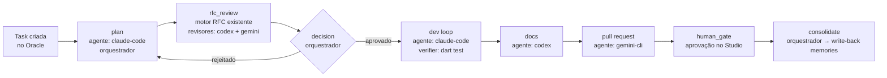

# Loop Engineering no Oracle AI — análise e plano (proposta v2.2.0)

> **Status: motor endurecido e monitor redesenhado na v2.2.7** (2026-07-20). O Oracle é o
> **hub de Loop Engineering** entre agentes de codificação — processos configuráveis (estilo n8n)
> que encadeiam loops especializados por agente (RFC → achados → dev loop → docs → PR), com todo o
> contexto fluindo pelo banco de memória. Este documento cobre o conceito, a análise, a arquitetura,
> o modelo de dados, as tools MCP, o runner, o Studio, riscos e o roadmap.
>
> **Já entregue:** migrações `v2.2.0`–`v2.2.7`, slice DDD `flow` em
> `oracle_memory`, 15 tools MCP `oracle_task_*`/`oracle_flow_*`, e o **Flow Runner** determinístico
> em `oracle_server` (`oracle_ai flow-worker`: claim com `FOR UPDATE SKIP LOCKED`, git worktree por
> run, launcher headless claude-code/codex/gemini/cursor, verificador fora do agente, inner loop,
> arestas success/failure/verdict/always, `human_gate` com retomada). O Figma foi atualizado com o
> **Fluxo Loop Engineering**, designer e monitor de grafo ao vivo. Também estão entregues RFC,
> sessões capturadas, fan-out/junção, sub-processos, retomada durável, leases cercados, pré-flight,
> supervisão de processos e contratos de orçamento/permissão/saída. Triggers seguem no roadmap.

---

## 1. O que é Loop Engineering

> Pesquisa realizada em 2026-07-18: 14+ artigos primários lidos na íntegra (Osmani, Willison,
> Huntley, Ronacher, Anthropic engineering, GitHub Next, HumanLayer, Aviator). Fontes completas em §1.6.

### 1.1 Definição

**Loop Engineering é a prática de projetar o sistema automatizado que prompta, verifica, lembra e
re-executa um agente de codificação — em vez de um humano digitar cada próxima instrução.** A
formulação canônica é do ensaio "Loop Engineering" de **Addy Osmani** (7–8 jun 2026):

> *"Loop engineering is replacing yourself as the person who prompts the agent. You design the
> system that does it instead."*

O ensaio nasceu de duas falas que viralizaram no mesmo dia:

> **Peter Steinberger** (criador do OpenClaw): *"You shouldn't be prompting coding agents anymore.
> You should be designing loops that prompt your agents."*
>
> **Boris Cherny** (head do Claude Code, Anthropic): *"I don't prompt Claude anymore. I have loops
> running that prompt Claude… My job is to write loops."*

Duas nuances importantes do próprio Osmani: (1) **o ponto de alavancagem mudou, o trabalho não
ficou mais fácil** — desenhar o loop é *mais* difícil que promptar; (2) o termo é o topo de uma
pilha aninhada que a comunidade consolidou: **prompt engineering (2022–24) → context engineering
(2025) → harness engineering (2025–26) → loop engineering (2026)**. O prompt vive num contexto, o
contexto vive num harness (tools, hooks, sandbox), e o harness roda dentro de um loop que decide
*o que tentar, quando verificar e quando parar*. Armin Ronacher descreve como dois loops
aninhados: o **agent loop** (interno — o LLM chamando tools) e o **harness loop** (externo — "uma
fila de trabalho; a máquina pega, tenta, para, e algo decide se aquilo era mesmo o fim"). Loop
Engineering é a disciplina do **loop externo** — exatamente a camada que a proposta deste
documento adiciona ao Oracle.

### 1.2 Linha do tempo do conceito

Anthropic "Building Effective Agents" formaliza os padrões (dez 2024) → GitHub Next cunha
"Continuous AI" (jun 2025) → o loop "Ralph Wiggum" de Geoffrey Huntley viraliza
(`while :; do cat PROMPT.md | claude-code; done`, jul–dez 2025) → Simon Willison nomeia "designing
agentic loops" como habilidade (set 2025) → Anthropic publica os harnesses de agentes de longa
duração (nov 2025) → post do Steinberger (7 jun 2026) → **Osmani nomeia e estrutura "Loop
Engineering"** (jun 2026), e o termo domina o discurso em semanas.

### 1.3 Anatomia de um loop bem projetado

Consenso das fontes — um loop precisa de **10 componentes** (esta lista é o checklist de design
que a proposta implementa, com o mapeamento para o Oracle em §2.2):

1. **Objetivo com "pronto" testável** — specs, listas de features com flags de aceite; "pensamento
   vago se multiplica por dezenas de execuções autônomas".
2. **Gatilho** ("o batimento") — cron, evento de repositório, fila de tarefas.
3. **Suprimento de contexto** — skills, AGENTS.md/regras, conectores (MCP) — "para não explicar o
   projeto toda vez"; e enxuto: "cada linha compete por atenção".
4. **Workspace isolado** — git worktrees/branches; git como rollback e auditoria.
5. **Capacidade de ação** — o harness do agente (tools, execução), com hooks como camada
   determinística.
6. **Verificador / sinal de feedback — a parte estrutural.** Ground truth determinístico (testes,
   build, lint) acima de auto-relato; idealmente **maker separado do checker** — "agentes exibem
   viés positivo ao avaliar o próprio trabalho" (Anthropic).
7. **Estado externo / espinha de memória** — estado que sobrevive à conversa (progress files,
   boards, memória persistente). Osmani: *"o mesmo truque de que todo agente de longa duração
   depende"*. **Contexto fresco por iteração + estado em disco vence uma sessão longa compactada**
   (a lição central do Ralph e da Anthropic).
8. **Critérios de terminação e escalação** — máximo de iterações, detecção de não-progresso
   (~3 tentativas travadas → matar/escalar), inbox de triagem para o que o loop não resolve.
9. **Orçamentos** — tetos de token/custo com auto-pausa.
10. **Gates humanos** — aprovação de plano antes de codar, revisão antes de merge; segurança e
    arquitetura sempre com humano.

### 1.4 Catálogo de padrões de loop

| Padrão | Descrição |
|---|---|
| **Verify-fix** | Rodar o sinal que falha → corrigir → re-rodar até verde (o inner loop básico) |
| **Maker-checker / evaluator-optimizer** | Um agente gera, outro avalia contra critérios; itera até passar (Anthropic 2024) |
| **Spec → implement → review** | Spec como entrada executável (Spec Kit, Ralph specs-first) |
| **Ralph Wiggum** | Reinício stateless por iteração, UMA tarefa por execução, estado em disco |
| **Overnight/cron batch** | Uma execução agendada por vez — "um refactor pequeno por manhã" |
| **Continuous AI** | Loops disparados por eventos do repo (triage, docs, qualidade) — CI de raciocínio |
| **Orchestrator-workers** | Planner decompõe em grafo de tarefas; workers em worktrees paralelas; líder sintetiza |
| **Initializer + session relay** | 1ª sessão constrói o andaime (progress file); cada sessão seguinte = orientar-se → 1 feature → testar → commitar → atualizar progresso (Anthropic) |
| **Multi-agent relay** | Agentes (inclusive de fornecedores diferentes) pegam o trabalho em sequência via estado compartilhado — **o padrão exato da proposta** |
| **Reflection / compound learning** | Aprendizados escritos de volta (regras/skills/memórias) para o próximo loop ser mais esperto — "o loop que melhora o loop" |

### 1.5 Modos de falha documentados (e o que a prática recomenda)

Falhas: erros compostos sem supervisão; **reward hacking do verificador** (agente apaga testes,
declara vitória prematura — literatura formal em 2026); **context rot** (sessões longas degradam
via compactação lossy); thrashing sem progresso; **explosão de custo** ("organizações gastando
mais em API do que em salários" — Aviator); **débito de compreensão** (código que ninguém do time
entende); rendição cognitiva ("quando o loop roda sozinho, é tentador parar de ter opinião").

Guardrails consensuais: verificação determinística fora do agente; maker ≠ checker; uma mudança
pequena e reversível por iteração, commitada; contexto fresco + estado externo; tetos duros de
iteração e detecção de não-progresso; orçamentos com auto-pausa; gates humanos em plano e merge;
hooks bloqueando ações destrutivas; **JSON para estado que o agente não deve reescrever**;
aprendizados de volta ao harness. Teste final de Ronacher: *"como não abdicamos do julgamento — e
garantimos que um humano responsável consiga continuar supervisionando"*.

### 1.6 Fontes principais

addyosmani.com/blog/loop-engineering · agent-harness-engineering · code-agent-orchestra ·
factory-model — ghuntley.com/ralph — humanlayer.dev/blog/brief-history-of-ralph —
simonwillison.net/2025/Sep/30/designing-agentic-loops — anthropic.com/engineering/building-effective-agents
· effective-harnesses-for-long-running-agents — githubnext.com/projects/continuous-ai —
lucumr.pocoo.org/2026/6/23/the-coming-loop — aviator.co/blog/the-rise-of-coding-agent-orchestrators —
x.com/steipete (post de 7 jun 2026) — arxiv 2604.15149 (LLMs Gaming Verifiers).

---

## 2. Análise da ideia — a visão × o que o Oracle já é

### 2.1 A visão, reformulada

A proposta do usuário, em uma frase: **o Oracle deixa de ser só a memória compartilhada e passa a
ser também o "quadro de processos"** — o lugar onde se define um fluxo de desenvolvimento completo
(como um workflow do n8n), onde cada nó é um *loop* executado por um agente escolhido pela sua
força (arquitetura, código, segurança, docs…), e onde todo o contexto do fluxo (tarefa, RFC,
achados, decisões, artefatos) fica disponível para o próximo agente do processo.

Restrições declaradas da visão:

1. **O Oracle NÃO é um agente.** Ele define processos e comandos; nunca "pensa".
2. **O orquestrador É um agente**, definido no processo (Claude Code, Codex, qualquer um).
3. **Uma tarefa criada no Oracle aciona o fluxo completo** com o processo escolhido.

### 2.2 Por que o Oracle é o lugar natural para isso

O padrão clássico que descreve exatamente essa arquitetura é o **blackboard** (IA dos anos 80,
revivido para sistemas multiagente): especialistas independentes que não se falam diretamente,
cooperando por meio de um quadro-negro compartilhado onde leem o estado e escrevem contribuições.
O Oracle **já é** esse quadro-negro — só falta o *control shell* (o componente que decide qual
especialista age agora). A tabela abaixo mostra o quanto do problema já está resolvido:

| O que um motor de loops precisa | O que o Oracle já tem (hoje, v2.1.0) |
|---|---|
| Contexto compartilhado entre agentes heterogêneos | Todo o banco: `memories`, `rules`, `architectures`, `skills`, escopo org→project→module |
| Passagem de bastão estruturada entre etapas | `handoffs` (summary, open_questions, next_steps, files_touched) — é exatamente um "step report" |
| Captura do que cada agente fez | Slice `capture`: `sessions → requests → messages/agent_events`, via hooks, para 7 harnesses |
| Etapa de revisão de spec com terminação e gate humano | Motor **RFC completo** (10 tabelas, evidência verificável, rounds com novelty, `awaiting_human`, write-back para `memories`) |
| Injeção de contexto no início de cada sessão de agente | Hook receiver (`SessionStart` brief + `UserPromptSubmit` recall com gate de distância) |
| Orçamento/telemetria por sessão | `sessions.input/output/total_tokens` (v2.0.0) + `session_metrics` |
| Conhecimento de como integrar cada harness | `AgentIntegration` matrix (claude-code, codex, cursor, gemini, vscode, windsurf, antigravity) + ponte `forward-hook` |
| Aprendizado do fluxo de volta para a memória | Write-back de `rfc_decisions → memories(kind=decision)` — o mesmo padrão serve para o fim de cada run |

Ou seja: **a ideia não é um desvio do produto; é a consequência natural dele.** O RFC (v2.1.0) já
é um "loop de revisão" completo com terminação multi-critério — o Loop Engineering generaliza esse
padrão para o ciclo de desenvolvimento inteiro, reutilizando as peças existentes como nós do fluxo.

### 2.3 Onde a visão precisa de um ajuste (o ponto central da análise)

Na visão original, o orquestrador-agente controla o loop principal: cria a RFC, despacha para o
loop de dev, depois docs, depois PR. O problema prático de um **agente como scheduler**:

- Um agente esperando outro terminar **queima tokens parado** (ou perde o estado se sair).
- Um LLM decidindo "qual o próximo passo" é exatamente a parte que **não pode falhar** — retry,
  timeout, orçamento e transição de estado precisam ser determinísticos, ou o fluxo inteiro fica
  não-confiável (é por isso que n8n/Temporal são código, não modelos).
- Contradiz a decisão de projeto do Oracle ("no consolidation LLM" — o servidor nunca pensa).

O ajuste proposto — **separar o loop de controle da cognição** (é a prática consolidada da
literatura, ver §1):

> **Controle é código; julgamento é agente.**
> O Oracle ganha um **runner determinístico** (máquina de estados, sem LLM) que executa o grafo do
> processo: dispara cada etapa, roda os verificadores, aplica orçamentos e transições. O
> **orquestrador continua sendo um agente configurável no processo** — mas ele é invocado *pelo
> runner* nos pontos que exigem julgamento: abrir a tarefa e planejar, escrever o brief da próxima
> etapa, decidir em nós de decisão (seguir/iterar/abortar), consolidar no fim. Ele não fica
> residente esperando; ele é chamado, decide, grava no quadro e sai.

Isso **preserva as três restrições da visão** (Oracle não pensa; orquestrador é um agente
configurável; a tarefa aciona o fluxo) e elimina a fragilidade do agente-scheduler. O runner não é
um agente: é o "motor do n8n" — infra, não cognição.

Há ainda um fato técnico que torna o runner **obrigatório**, não preferência: **MCP é
estruturalmente pull.** Um servidor MCP não consegue "acordar" um agente conectado — as únicas
interações iniciadas pelo servidor são sampling (não suportado pelo Claude Code — issue #1785
aberta há muito), elicitation e notificações. O próprio spec de tasks longas do MCP (SEP-1686,
rev. 2025-11-25) canonizou **polling autoritativo** em vez de push, porque sobrevive a
desconexões. Conclusão: o estado vive no Oracle, os agentes puxam contexto e reportam por tools —
e **algo fora do MCP precisa lançar os processos**. Esse algo é o runner.

### 2.4 Posicionamento — o espaço que ninguém ocupa

A pesquisa mapeou os "hubs de memória entre agentes" existentes (Memorix, agentmemory, ai-memory,
codex-agent-mem): todos fazem **armazenamento e handoff** — nenhum faz **verificação, adjudicação
ou semântica de revisão**. O lado maker/checker e a revisão fundamentada em evidência só existem
hoje *dentro* de harnesses de um único fornecedor. O Oracle com RFC + Loop Engineering ocuparia
exatamente esse vazio: **o único hub que, além de lembrar e passar o bastão, verifica e julga.**

E a arquitetura tem validação acadêmica recente: o padrão **blackboard aplicado a sistemas
multiagente com LLMs** (arXiv 2507.01701) alcançou qualidade competitiva com os sistemas SOTA
**gastando menos tokens** — quadro compartilhado + especialistas + unidade de controle é
precisamente Oracle + agentes de etapa + runner/orquestrador. Também alinha com o princípio de
produção da Cognition ("Don't Build Multi-Agents"): **escritas em thread única; agentes adicionais
contribuem inteligência (achados, revisões), não ações** — que é como o RFC já funciona e como os
flows devem funcionar (um dev loop escreve; revisores leem).

---

## 3. Decisões de arquitetura

### D1 — Oracle continua não sendo agente; nasce o **Flow Runner** (infra, sem LLM)

Novo componente em `oracle_server` (hospedado pelo Studio como o hooks daemon, e via CLI para
headless/CI): um worker que reivindica runs enfileirados (`SELECT … FOR UPDATE SKIP LOCKED`),
executa o grafo etapa a etapa, lança cada agente **headless** com o prompt composto, roda os
verificadores e grava cada transição em um log de eventos. O servidor continua **nunca** chamando
LLM — quem pensa são os agentes lançados.

### D2 — O modelo de execução: híbrido (runner dirige, orquestrador decide)

Três modelos avaliados:

| Modelo | Como funciona | Veredicto |
|---|---|---|
| **A. Orquestrador puro** (visão original literal) | Um agente residente lê o processo via MCP e spawna os outros agentes ele mesmo | Frágil: custo de agente ocioso, permissões de spawn, sem retry/orçamento confiável, perde tudo se cair |
| **B. Runner puro** | O runner executa tudo; nenhum papel de orquestrador | Confiável mas burro: sem planejamento, sem decisão contextual entre etapas, briefs mecânicos |
| **C. Híbrido** ✅ | Runner determinístico executa o grafo; o **orquestrador é um agente** invocado como etapa (plan, decision, consolidate) e configurável por processo | Confiabilidade de workflow engine + julgamento de LLM onde importa |

### D3 — Invocação dos agentes: **push pelo runner**, headless, um processo por etapa

O runner lança o CLI do agente da etapa em modo não-interativo *(flags exatas na matriz §7.2)*,
no diretório de trabalho do run, com o MCP do Oracle já configurado (o installer já sabe fazer
isso por agente). O agente da etapa:

1. Recebe o prompt composto (tarefa + brief da etapa + bundle de contexto + critérios de saída);
2. Trabalha normalmente — **os hooks já capturam a sessão** (`sessions/requests/messages`), de graça;
3. Termina chamando `oracle_flow_step_report` (relatório estruturado, estilo handoff);
4. O runner roda os **verificadores** (comando de teste/build, checks do relatório, status do RFC…)
   e decide: **iterar** (mesma etapa, feedback do verificador anexado — o *inner loop*), **avançar**
   (aresta do grafo), **parquear** (`awaiting_human`) ou **falhar**.

### D4 — Contexto entre etapas: o blackboard é o banco

Nada de arquivos soltos ou JSON passado por pipe. Cada run tem:

- **`flow_run_context`** — chave→valor (jsonb) escrito pelas etapas (ex.: `rfc_id`, `branch`,
  `plan`, `findings_summary`) — o quadro-negro do run;
- **`flow_artifacts`** — referências tipadas produzidas (branch, commit, PR URL, RFC, doc, memory);
- **step reports** — o handoff estruturado de cada etapa (o que fiz, o que falta, arquivos);
- **grounding automático** — o bundle de contexto de cada etapa inclui as regras aplicáveis
  (`rules_for_task`), memórias/decisões relevantes e o link da RFC — mesmo padrão do bloco
  `grounding` que o `oracle_rfc_get` já monta.

### D5 — Isolamento de workspace: uma branch (e worktree) por run

O runner cria `flow/<task-slug>-<id-curto>` e um git worktree dedicado; todas as etapas trabalham
ali. Agentes paralelos de runs diferentes nunca colidem; o PR final sai dessa branch; abortar um
run é descartar a worktree. (Padrão consolidado nos projetos de orquestração — ver §1/§7.)

### D6 — Terminação e guardrails: multi-critério, imposto pelo runner (não pelo modelo)

Herdado da lição do RFC (novelty + rounds + budget) e da literatura de loops:

- **Orçamentos por run e por etapa**: max iterações, max tokens (os hooks já somam
  `sessions.total_tokens`), max tempo de parede;
- **Verificador fora do agente**: o comando de verificação roda pelo runner no worktree — o agente
  não pode "se auto-aprovar";
- **Detecção de não-progresso**: verificador com o mesmo resultado N vezes seguidas → `stalled`;
- **Gate humano**: etapa `human_gate` e o estado `awaiting_human` (aprovação pelo Studio), como no RFC;
- **Auditoria total**: `flow_run_events` (append-only) + sessão capturada de cada etapa.

### D7 — Contrato de saída estruturado por etapa (as arestas roteiam sobre ele)

Cada etapa pode declarar um **JSON Schema de saída** (`output_schema`). O adapter mapeia para o
mecanismo nativo do harness (`--json-schema` no Claude Code, `--output-schema` no Codex; nos
harnesses sem suporte, instrução "responda só JSON" + validação + retry). As condições das arestas
e os `reportChecks` do verificador avaliam **campos desse output** — como os items do n8n e o
`Choice` do Step Functions. Saída que falha na validação = **falha retryável**, nunca um avanço
silencioso.

### D8 — Menor privilégio por etapa + identidade por etapa

- **Perfil de permissão por etapa** (`permissions`): revisor = read-only
  (`--sandbox read-only` no Codex é default; allowlist de leitura no Claude); docs = escrita
  restrita a `docs/`; só o dev loop ganha `workspace-write`/`acceptEdits`. Preferir
  `--permission-mode dontAsk` + allowlists explícitas aos flags "nucleares" de bypass; bypass
  total só em container.
- **Token de claim por etapa**: MCP tem confusão de identidade de chamador documentada (arXiv
  2603.07473) — o servidor não sabe *qual* agente chama. O runner injeta um token por
  `run_step`; as tools `oracle_flow_step_*` o exigem, e o servidor valida **server-side** o que
  aquela etapa pode escrever (ex.: revisor grava achados, não memórias). Extensão natural dos
  session tokens da v2.0.0.
- **Definição congelada**: como o `gh aw compile` do GitHub, `oracle_flow_save` valida o grafo
  (schema, arestas, agentes conhecidos) e cada run **pina a versão** — um run em andamento nunca
  vê a definição mudar.

---

## 4. Como funciona — o fluxo completo, com um exemplo concreto

Processo de exemplo, "**feature-completa**" (orquestrador: claude-code):



Passo a passo do run:

1. **Task** — `oracle_task_create` (pelo humano no Studio, por um agente, ou futuramente por
   trigger). `oracle_flow_run_start(taskId, flowKey)` enfileira o run (`queued`).
2. **Claim** — o Flow Runner (Studio ou `oracle_ai flow-worker`) reivindica o run, cria a branch +
   worktree, marca `running` e grava o evento.
3. **plan** — o runner lança o orquestrador (claude-code headless) com a tarefa + grounding. Ele
   escreve o plano no contexto do run (`oracle_flow_context_put`) e o brief das etapas seguintes;
   `oracle_flow_step_report` fecha a etapa.
4. **rfc_review** — etapa do tipo `rfc_review`: o runner abre a RFC a partir do plano
   (`oracle_rfc_open` com as seções do plano), lança os agentes revisores configurados (codex,
   gemini) que comentam com evidência (`oracle_rfc_comment`/`evidence_add`), e usa
   `oracle_rfc_status` como **verificador da etapa** (0 criticals verificados + seções cobertas).
   O motor RFC inteiro (rounds, novelty, contestação) roda dentro desta etapa sem mudança.
5. **decision** — o orquestrador é invocado com o estado do RFC e decide a aresta (`aprovado` →
   dev; `rejeitado` → volta ao plan com o feedback). Decisão gravada em `flow_run_events`.
6. **dev loop** — o *inner loop* clássico: claude-code implementa no worktree; ao terminar, o
   runner roda `dart analyze && dart test` (o `exit_criteria` da etapa). Falhou → nova iteração da
   MESMA etapa com a saída do verificador anexada ao prompt (até `max_iterations`). Passou → avança.
7. **docs** — codex lança com o diff da branch + step reports anteriores; atualiza `docs/`.
8. **pull request** — o agente da etapa cria o PR (`gh` ou web) e registra o artifact `pr_url`.
9. **human_gate** — run parqueia em `awaiting_human`; o Studio notifica; aprovação libera.
10. **consolidate** — o orquestrador grava decisões/gotchas do run em `memories` (write-back, como
    o `oracle_rfc_finalize` já faz) e fecha o run (`completed`). A tarefa vai para `done`.

Em qualquer ponto: orçamento estourado → `stalled`; falha sem rota → `failed`; tudo visível na
timeline do Studio; toda sessão de todo agente capturada e ligada à etapa que a gerou.

---

## 5. Modelo de dados — migração `v2.2.0/001_flows` (9 tabelas)

Mesmas convenções da casa: uuid PK, `timestamptz`, owner CHECK (`organization_id` /
`project_id` / `module_id`), `is_latest`/`supersedes` para versionamento, `CHECK` para enums,
`embedding vector(1024)` + `fts` gerada onde há busca, índices HNSW/GIN/btree/parciais.

### 5.1 `tasks` — o backlog que aciona fluxos

```sql
CREATE TABLE IF NOT EXISTS tasks (
    id               uuid PRIMARY KEY DEFAULT gen_random_uuid(),
    organization_id  uuid REFERENCES organizations(id) ON DELETE CASCADE,
    project_id       uuid REFERENCES projects(id)      ON DELETE CASCADE,
    module_id        uuid REFERENCES modules(id)       ON DELETE CASCADE,
    title            text NOT NULL,
    description      text NOT NULL DEFAULT '',
    status           text NOT NULL DEFAULT 'backlog'
                     CHECK (status IN ('backlog','ready','running','blocked','done','cancelled')),
    priority         integer NOT NULL DEFAULT 50,          -- 0..100, como rules.priority
    source           text NOT NULL DEFAULT 'human'
                     CHECK (source IN ('human','agent','flow')),
    rfc_id           uuid REFERENCES rfcs(id) ON DELETE SET NULL,   -- spec quando houver
    created_by       text NOT NULL DEFAULT 'human',        -- humano | nome do agente
    embedding        vector(1024),
    embedding_model  text,
    fts              tsvector GENERATED ALWAYS AS
                       (to_tsvector('simple', title || ' ' || description)) STORED,
    created_at       timestamptz NOT NULL DEFAULT now(),
    updated_at       timestamptz NOT NULL DEFAULT now(),
    CONSTRAINT tasks_owner_check
        CHECK (organization_id IS NOT NULL OR project_id IS NOT NULL OR module_id IS NOT NULL)
);
```

Busca híbrida como as demais (dedup de tarefas: "isso já foi pedido?" reusa o padrão de
`oracle_request_search`).

### 5.2 `flows` — a definição do processo (o "workflow do n8n")

```sql
CREATE TABLE IF NOT EXISTS flows (
    id                  uuid PRIMARY KEY DEFAULT gen_random_uuid(),
    organization_id     uuid REFERENCES organizations(id) ON DELETE CASCADE,
    project_id          uuid REFERENCES projects(id)      ON DELETE CASCADE,
    module_id           uuid REFERENCES modules(id)       ON DELETE CASCADE,
    key                 text NOT NULL,                    -- identidade estável (versiona por key)
    name                text NOT NULL,
    description         text NOT NULL DEFAULT '',
    orchestrator_agent  text NOT NULL DEFAULT 'claude-code',  -- o agente-orquestrador do processo
    entry_step_key      text NOT NULL,                    -- nó inicial do grafo
    budgets             jsonb NOT NULL DEFAULT '{}',      -- defaults: maxTotalTokens, maxWallMinutes…
    version_no          integer NOT NULL DEFAULT 1,
    is_latest           boolean NOT NULL DEFAULT true,
    supersedes          uuid REFERENCES flows(id) ON DELETE SET NULL,
    retired_at          timestamptz,
    retired_reason      text,
    created_at          timestamptz NOT NULL DEFAULT now(),
    updated_at          timestamptz NOT NULL DEFAULT now(),
    CONSTRAINT flows_owner_check
        CHECK (organization_id IS NOT NULL OR project_id IS NOT NULL OR module_id IS NOT NULL)
);
-- índice parcial: um "latest" por key por escopo (padrão uq_rules_project_latest)
```

Re-salvar a mesma `key` supersede (como rules/skills). Runs **pinam a versão** — editar um flow
nunca muda um run em andamento.

### 5.3 `flow_steps` — os nós (cada nó é um loop)

```sql
CREATE TABLE IF NOT EXISTS flow_steps (
    id               uuid PRIMARY KEY DEFAULT gen_random_uuid(),
    flow_id          uuid NOT NULL REFERENCES flows(id) ON DELETE CASCADE,
    step_key         text NOT NULL,                      -- identidade dentro do flow
    name             text NOT NULL,
    kind             text NOT NULL DEFAULT 'agent'
                     CHECK (kind IN ('agent',           -- loop de agente headless (o caso geral)
                                     'orchestrator',    -- idem, mas com o agente-orquestrador do flow (único, entrada)
                                     'decision',        -- agente avalia e grava "verdict" → roteia 2..N caminhos (v2.2.3)
                                     'rfc_create',      -- agente PUBLICA a spec como RFC (v2.2.x)
                                     'rfc_review',      -- delega ao motor RFC existente
                                     'rfc_consolidate', -- resolve achados, revisa a RFC e escreve o plano (v2.2.x)
                                     'rfc_gate',        -- portão determinístico de rodadas: continuar/concluir/limite (v2.2.x)
                                     'subflow',         -- executa OUTRO processo como run filho, inline (v2.2.4)
                                     'command',         -- comando determinístico (build, deploy)
                                     'human_gate')),    -- parqueia até aprovação no Studio
    agent            text,                              -- claude-code|codex|cursor|gemini|… (kind=agent)
    model            text,                              -- override opcional do modelo do harness
    role             text,                              -- persona: architect|implementer|security|docs|…
    prompt_template  text NOT NULL DEFAULT '',          -- com placeholders {task} {context} {feedback}…
    command          text,                              -- kind=command
    output_schema    jsonb,                             -- JSON Schema do output da etapa (D7)
    permissions      jsonb NOT NULL DEFAULT '{}',       -- perfil de menor privilégio (D8)
    exit_criteria    jsonb NOT NULL DEFAULT '{}',       -- verificadores: {commands:[…], reportChecks:[…], rfc:{…}}
    max_iterations   integer NOT NULL DEFAULT 3,        -- o inner loop
    token_budget     bigint,
    timeout_minutes  integer NOT NULL DEFAULT 30,
    on_fail          text NOT NULL DEFAULT 'park'
                     CHECK (on_fail IN ('park','halt','continue')),
    config           jsonb NOT NULL DEFAULT '{}',       -- extras por kind (ex.: revisores do rfc_review)
    position         integer NOT NULL DEFAULT 0,        -- ordenação p/ exibição
    created_at       timestamptz NOT NULL DEFAULT now()
);
CREATE UNIQUE INDEX IF NOT EXISTS uq_flow_steps_key ON flow_steps (flow_id, step_key);
```

### 5.4 `flow_edges` — as arestas (o "ligar os loops" do n8n)

```sql
CREATE TABLE IF NOT EXISTS flow_edges (
    id             uuid PRIMARY KEY DEFAULT gen_random_uuid(),
    flow_id        uuid NOT NULL REFERENCES flows(id)      ON DELETE CASCADE,
    from_step      uuid NOT NULL REFERENCES flow_steps(id) ON DELETE CASCADE,
    to_step        uuid NOT NULL REFERENCES flow_steps(id) ON DELETE CASCADE,
    condition      text NOT NULL DEFAULT 'success'
                   CHECK (condition IN ('success',   -- verificadores passaram
                                        'failure',   -- esgotou iterações/orçamento
                                        'verdict',   -- rota escolhida pelo AGENTE do nó (qualquer nó decide)
                                        'always')),
    verdict_value  text,                              -- ex.: 'aprovado' | 'rejeitado' (condition=verdict)
    instruction    text,                              -- QUANDO seguir por esta rota — vai para o prompt do
                                                      -- agente do nó de origem (v2.2.5); torna qualquer nó
                                                      -- um ponto de decisão, sem nó dedicado
    created_at     timestamptz NOT NULL DEFAULT now()
);
```

Fase 1 executa grafos **sequenciais com desvio condicional** (uma aresta ativa por vez);
paralelismo (fan-out/fan-in) fica para a Fase 3 — a modelagem por arestas já suporta.

### 5.5 `flow_runs` — a instância em execução

```sql
CREATE TABLE IF NOT EXISTS flow_runs (
    id               uuid PRIMARY KEY DEFAULT gen_random_uuid(),
    flow_id          uuid NOT NULL REFERENCES flows(id) ON DELETE RESTRICT,  -- versão pinada
    task_id          uuid REFERENCES tasks(id) ON DELETE SET NULL,
    project_id       uuid REFERENCES projects(id) ON DELETE CASCADE,         -- escopo de execução
    status           text NOT NULL DEFAULT 'queued'
                     CHECK (status IN ('queued','running','awaiting_human','paused',
                                       'stalled','completed','failed','cancelled')),
    current_step_id  uuid REFERENCES flow_steps(id) ON DELETE SET NULL,
    branch_name      text,
    worktree_path    text,
    budgets          jsonb NOT NULL DEFAULT '{}',     -- efetivos (flow defaults + overrides)
    tokens_used      bigint NOT NULL DEFAULT 0,       -- somado das sessions das etapas
    started_by       text NOT NULL DEFAULT 'human',
    claimed_by       text,                            -- id do worker (lease)
    heartbeat_at     timestamptz,                     -- worker vivo? (retomada de run órfão)
    error            text,
    created_at       timestamptz NOT NULL DEFAULT now(),
    started_at       timestamptz,
    ended_at         timestamptz
);
CREATE INDEX IF NOT EXISTS idx_flow_runs_claim ON flow_runs (status, created_at);
```

### 5.6 `flow_run_steps` — cada iteração de cada etapa

```sql
CREATE TABLE IF NOT EXISTS flow_run_steps (
    id            uuid PRIMARY KEY DEFAULT gen_random_uuid(),
    run_id        uuid NOT NULL REFERENCES flow_runs(id)  ON DELETE CASCADE,
    step_id       uuid NOT NULL REFERENCES flow_steps(id) ON DELETE CASCADE,
    iteration     integer NOT NULL DEFAULT 1,             -- 1..max_iterations (o inner loop)
    status        text NOT NULL DEFAULT 'running'
                  CHECK (status IN ('running','verifying','passed','failed','skipped','parked')),
    agent         text,
    session_id    uuid REFERENCES sessions(id) ON DELETE SET NULL,  -- ← a sessão CAPTURADA da etapa
    claim_token   text,                                  -- identidade da etapa nas tools (D8)
    rendered_prompt text,                                 -- o prompt final enviado (auditoria)
    report        jsonb,                                  -- o step report estruturado do agente
    verifier      jsonb,                                  -- resultados dos verificadores
    tokens_used   bigint NOT NULL DEFAULT 0,
    started_at    timestamptz NOT NULL DEFAULT now(),
    ended_at      timestamptz
);
CREATE UNIQUE INDEX IF NOT EXISTS uq_flow_run_steps ON flow_run_steps (run_id, step_id, iteration);
```

`session_id` liga a etapa à conversa auditável do Oracle; `agent_session_id` guarda a conversa
nativa do CLI. O runner cria uma sessão Oracle determinística por nó e abre um request por
interação. Na primeira chamada ele define o id quando o harness permite (Claude/Gemini) ou captura
o id do output estruturado (Codex/Cursor). Retentativas e retornos ao mesmo nó usam `--resume`/
`codex exec resume`, inclusive após reinício do worker. Nós e ramos diferentes nunca compartilham
contexto. Hooks podem enriquecer a captura, mas não são requisito para auditoria ou continuidade.

### 5.7 `flow_run_context` — o blackboard do run

```sql
CREATE TABLE IF NOT EXISTS flow_run_context (
    run_id      uuid NOT NULL REFERENCES flow_runs(id) ON DELETE CASCADE,
    key         text NOT NULL,                        -- 'plan' | 'rfc_id' | 'findings_summary' | …
    value       jsonb NOT NULL,
    updated_by  uuid REFERENCES flow_run_steps(id) ON DELETE SET NULL,
    updated_at  timestamptz NOT NULL DEFAULT now(),
    PRIMARY KEY (run_id, key)
);
```

### 5.8 `flow_artifacts` — o que o run produziu

```sql
CREATE TABLE IF NOT EXISTS flow_artifacts (
    id           uuid PRIMARY KEY DEFAULT gen_random_uuid(),
    run_id       uuid NOT NULL REFERENCES flow_runs(id) ON DELETE CASCADE,
    run_step_id  uuid REFERENCES flow_run_steps(id) ON DELETE SET NULL,
    kind         text NOT NULL
                 CHECK (kind IN ('branch','commit','pr','rfc','doc','file','memory','other')),
    locator      text NOT NULL,                       -- URL, path, id — como rfc_comment_evidence
    meta         jsonb NOT NULL DEFAULT '{}',
    created_at   timestamptz NOT NULL DEFAULT now()
);
```

### 5.9 `flow_run_events` — timeline append-only (auditoria + Studio)

```sql
CREATE TABLE IF NOT EXISTS flow_run_events (
    id           uuid PRIMARY KEY DEFAULT gen_random_uuid(),
    run_id       uuid NOT NULL REFERENCES flow_runs(id) ON DELETE CASCADE,
    run_step_id  uuid REFERENCES flow_run_steps(id) ON DELETE SET NULL,
    kind         text NOT NULL
                 CHECK (kind IN ('state','step_start','step_end','verifier','iteration',
                                 'decision','gate','budget','error','info')),
    payload      jsonb NOT NULL DEFAULT '{}',
    created_at   timestamptz NOT NULL DEFAULT now()
);
CREATE INDEX IF NOT EXISTS idx_flow_run_events_run ON flow_run_events (run_id, created_at);
```

**Sem mudança em nenhuma tabela existente.** As costuras são todas por FK novas:
`tasks.rfc_id → rfcs`, `flow_run_steps.session_id → sessions`, `flow_artifacts → memories/rfcs`
via locator. A migração é aditiva e forward-only como as demais.

---

## 6. Tools MCP novas (15) — `oracle_task_*` e `oracle_flow_*`

O agente de uma etapa usa 3 tools no caminho feliz (contexto → trabalho → report); as demais são
para definir processos, acionar e monitorar.

### Tarefas

| Tool | Args | Descrição |
|---|---|---|
| `oracle_task_create` | `title`, `description?`, escopo, `priority?`, `rfcId?` | Cria a tarefa no backlog (dedup semântico avisa se já existe parecida). |
| `oracle_task_list` | escopo, `status?`, `search?`, `limit?` | Backlog com busca híbrida. |
| `oracle_task_update` | `id`, `status?`, `priority?`, `description?` | Atualiza/move a tarefa. |

### Definição de processos

| Tool | Args | Descrição |
|---|---|---|
| `oracle_flow_save` | `key`, `name`, escopo, `orchestratorAgent?`, `steps[]`, `edges[]`, `budgets?` | Define/versiona o processo inteiro em uma chamada (steps + edges); mesma `key` supersede. |
| `oracle_flow_list` | escopo, `limit?` | Processos disponíveis (latest). |
| `oracle_flow_get` | `id?` \| `key?` + escopo | Grafo completo do processo. |

### Execução e monitoramento

| Tool | Args | Descrição |
|---|---|---|
| `oracle_flow_run_start` | `taskId`, `flowKey` \| `flowId`, `budgets?` | **Enfileira** o run (`queued`) — quem executa é o Flow Runner. |
| `oracle_flow_run_status` | `runId` | Snapshot: etapa atual, iterações, orçamento, eventos recentes — o análogo do `oracle_rfc_status`. |
| `oracle_flow_run_list` | escopo, `status?`, `limit?` | Runs recentes/ativos. |
| `oracle_flow_run_control` | `runId`, `action` ∈ pause/resume/cancel | Controle do run. |
| `oracle_flow_gate_decide` | `runId`, `approved`, `reason?` | Resolve um `human_gate` / `awaiting_human` (Studio chama por dentro; humano-no-loop). |

### Dentro de uma etapa (usadas pelo agente lançado)

| Tool | Args | Descrição |
|---|---|---|
| `oracle_flow_step_context` | `runStepId` (o runner injeta o id no prompt) | O bundle da etapa: tarefa, plano, contexto do run, reports anteriores, artifacts, grounding (regras + decisões). Liga a sessão do agente à etapa. |
| `oracle_flow_context_put` | `runStepId`, `key`, `value` | Escreve no blackboard do run. |
| `oracle_flow_artifact_add` | `runStepId`, `kind`, `locator`, `meta?` | Registra artefato produzido (PR, commit, doc…). |
| `oracle_flow_step_report` | `runStepId`, `summary`, `status` ∈ done/blocked, `outputs?`, `filesTouched?`, `openQuestions?` | O handoff estruturado que **fecha a etapa** — gatilho para o runner verificar e avançar. |

---

## 7. O Flow Runner — o componente novo

### 7.1 Anatomia (tudo em Dart, dentro do monorepo)

```
oracle_memory/lib/src/flow/           # slice DDD novo (11º): entidades, usecases, repos
oracle_server/lib/src/flow/
  flow_worker.dart                    # loop do worker: claim → drive → heartbeat
  step_launcher.dart                  # adapters headless por agente (matriz §7.2)
  prompt_composer.dart                # template + task + contexto + feedback do verificador
  verifier.dart                       # roda exit_criteria no worktree (Process.run)
  workspace.dart                      # branch + git worktree por run
```

- **Hospedagem**: o Studio hospeda o worker como já hospeda o hooks daemon (tray-first, um
  processo dono de tudo); `oracle_ai flow-worker` roda o mesmo worker headless (servidor/CI).
- **Claim seguro**: `FOR UPDATE SKIP LOCKED` + `claimed_by`/`heartbeat_at` — dois workers nunca
  pegam o mesmo run; run órfão (heartbeat vencido) é retomável do último evento (o estado inteiro
  vive no banco, nunca em memória do worker).
- **Retomada**: como toda transição está em `flow_run_events` e todo output em
  `flow_run_steps.report`, matar o worker no meio de um run e religar continua do ponto exato —
  a propriedade "durable execution" (Temporal) obtida com o banco que já existe.

### 7.2 Matriz de lançamento headless por agente

O adapter de cada harness é **dados, não código** (espelha o `agentIntegrations()` do installer):
`{ comando de invocação, mecanismo de output estruturado, resume, flags de permissão, injeção de
MCP, auth }`. Flags confirmadas na pesquisa (docs oficiais, jul/2026):

| Harness | Invocação headless típica de uma etapa | Observações |
|---|---|---|
| **Claude Code** | `claude --bare -p "<prompt>" --output-format json --json-schema <schema> --mcp-config <oracle.json> --permission-mode dontAsk --allowedTools …` | O caso mais forte: `--bare` = passo reprodutível (sem auto-descoberta); JSON traz `session_id` e `total_cost_usd`; `--resume <id>` (escopado ao diretório/worktree); hooks disparam em `-p` (captura funciona) |
| **Codex CLI** | `codex exec "<prompt>" --json --output-schema <schema.json> --sandbox workspace-write -C <worktree>` | JSONL de eventos com `usage` de tokens; `-o` grava a última mensagem em arquivo; `codex exec resume <id>`; MCP no `config.toml` com `required=true` (falha dura se o Oracle não subir — ótimo p/ pipeline) |
| **Gemini CLI** | `gemini -p "<prompt>" --output-format json --approval-mode auto_edit` | Métricas ricas por run (`stats`); `--resume <uuid>`; *quirk*: o JSON headless não retorna o session id (issue #14435) — capturar via hooks |
| **Cursor CLI** | `cursor-agent -p "<prompt>" --force --output-format stream-json` | Sem `--force` só propõe edits; relatos de `-p` travando indefinidamente → timeout por etapa é obrigatório |
| **Copilot CLI** | `copilot -p "<prompt>" -s --no-ask-user --allow-tool=…` | O mais fraco p/ pipeline: sem output JSON do run, resume só interativo → tratar como etapa stateless texto-in/texto-out |

Regras do launcher (todas vindas dos modos de falha catalogados): timeout duro por etapa;
harness sem schema nativo → validação + retry no runner; **sessões do harness são cache, nunca
fonte de verdade** (proprietárias e escopadas por diretório — toda etapa precisa ser
cold-startável só dos artefatos + blackboard); transcript bruto (stream-json/JSONL) persistido
como artefato da etapa.

### 7.3 Composição do prompt de uma etapa (exemplo)

```
Você é a etapa "dev" do processo "feature-completa" (run {run_id}).
Papel: {role}. Trabalhe SOMENTE no worktree atual (branch {branch}).

## Tarefa
{task.title}: {task.description}

## Brief desta etapa (escrito pelo orquestrador)
{context.dev_brief}

## Contexto do run
- RFC aprovada: {context.rfc_id} (use oracle_rfc_get para as seções e decisões)
- Reports das etapas anteriores: {reports_summary}

## Critérios de saída (o runner vai verificar — não se auto-aprove)
- `dart analyze` sem erros e `dart test` verde no worktree
{feedback_do_verificador_se_iteracao > 1}

Ao terminar: chame oracle_flow_step_report(runStepId: "{run_step_id}", …).
Comece chamando oracle_flow_step_context(runStepId: "{run_step_id}").
```

---

## 8. Oracle Studio — a face visual (o "n8n" do usuário)

Novo grupo de features no Studio (padrão dos slices existentes: `features/flows/…`):

1. **Tasks** — o backlog: criar/editar tarefas, disparar "Executar com processo…" (o botão que
   realiza a visão "criar uma tarefa e acionar o fluxo completo").
2. **Flows (designer)** — Fase 1: editor estruturado (lista ordenada de etapas + condições, forms
   por kind); Fase 3: canvas visual de grafo (nós + arestas, estilo n8n).
3. **Runs (monitor)** — a tela mais importante: timeline ao vivo (de `flow_run_events`), etapa
   atual com iterações e resultado dos verificadores, orçamento consumido, link para a **sessão
   capturada** de cada etapa (drill-down até as mensagens), botões pause/cancel e **Aprovar** nos
   gates humanos, artefatos (PR, RFC, docs) clicáveis.
4. **Settings** — diretório de worktrees, paths dos CLIs dos agentes, limites globais de orçamento,
   toggle do worker no tray.

---

## 9. O que já funciona de graça (as sinergias)

| Peça existente | Papel no Loop Engineering |
|---|---|
| Hooks + capture | Toda etapa vira uma sessão capturada e ligada (`flow_run_steps.session_id`) — auditoria e replay sem código novo de captura |
| `sessions.total_tokens` | Enforcement de orçamento por etapa/run — só somar |
| Motor RFC | O kind `rfc_review` inteiro: revisão com evidência, rounds, novelty e gate — já pronto |
| `handoffs` | O modelo conceitual do step report (mesma forma; agora estruturado por etapa) |
| `rules_for_task` + grounding do RFC | O bundle de contexto de cada etapa |
| `AgentIntegration` matrix + installer | O runner sabe configurar MCP/hooks para cada harness lançado |
| Write-back RFC → memories | O padrão da etapa `consolidate` (o run aprende para o futuro) |
| Studio (tray + daemon host) | Hospedagem natural do worker; UI de aprovação dos gates |

---

## 10. Riscos e mitigação

| # | Risco | Mitigação |
|---|---|---|
| 1 | **Custo descontrolado** (loops queimando tokens) | Orçamentos obrigatórios por run/etapa impostos pelo runner; `stalled` em não-progresso; painel de tokens no monitor (dados já capturados) |
| 2 | **Agente "engana" o verificador** (reward hacking: pula teste, marca como feito) | Verificador roda **fora** do agente (runner, no worktree); critérios de saída = comandos/checks objetivos, nunca auto-relato |
| 3 | **Fragilidade dos CLIs headless** (flags mudam, comportamentos diferentes por harness) | Adapter por agente isolado em `step_launcher.dart`; matriz de suporte com fallback (começar com claude-code + codex, os mais estáveis; expandir depois) |
| 4 | **Windows** (spawn de processos, paths de worktree, permissões) | O projeto já venceu isso no installer/hooks (lição do 47500); worktrees em diretório configurado sem espaços; testes no CI Windows |
| 5 | **Contexto perdido entre etapas** (context rot) | Blackboard estruturado + step reports obrigatórios + grounding automático; o próximo agente NUNCA depende do transcript do anterior — só do que foi estruturadamente gravado |
| 6 | **Runs órfãos** (worker morre no meio) | Lease + heartbeat; estado 100% no banco; retomada do último evento |
| 7 | **Loop infinito entre etapas** (decision devolvendo para plan eternamente) | Contador de visitas por etapa no run + orçamento global de etapas; exceder → `stalled` (mesmo padrão do round/novelty do RFC) |
| 8 | **Escopo demais de uma vez** | Roadmap em 3 fases (§11); Fase 1 é utilizável sozinha (fluxo linear já resolve o caso do exemplo) |
| 9 | **Identidade do chamador** (qualquer agente conectado poderia mexer num run) | Token de claim por etapa (D8) + validação server-side do que cada kind de etapa pode escrever |
| 10 | **Excesso de topologia** (a armadilha do claude-flow: mesh/consensus/hive sem benefício verificado) | Só dois primitivos de composição: **sequência** e **fan-out read-only com fan-in** — os únicos com ganho comprovado em produção (Cognition/Anthropic: multiagente paralelo custa ~15× tokens; vale para leitura/revisão, não para escrita) |

---

## 11. Roadmap proposto

### Fase 1 — o esqueleto que anda (v2.2.0)
Migração + slice `flow` + `tasks`; tools MCP; runner com fluxo **sequencial** (kinds `agent`,
`command`, `human_gate`); adapters claude-code + codex; branch/worktree por run; step
context/report; Studio: Tasks + Runs (monitor read-only + aprovar gate). **Critério de pronto:**
o fluxo do exemplo §4 sem o nó de decisão roda de ponta a ponta neste repositório.

### Fase 2 — o loop de verdade (v2.3.0)
Inner loop com verificadores + feedback por iteração; kinds `orchestrator` e `rfc_review`
(integração com o motor RFC); arestas condicionais + `decision`; orçamentos + stall detection;
adapters gemini + cursor; Studio: editor de flows + timeline ao vivo.

### Fase 3 — o n8n completo (v2.4.0+)
Paralelismo (fan-out/fan-in de etapas); canvas visual; triggers (cron, webhook/GitHub);
templates de processos compartilháveis; calibração por agente (que harness vai bem em qual papel
— substrato análogo ao `rfc_participants`); métricas comparativas de processos.

---

## 12. Veredicto de viabilidade

**Sim — dá para desenvolver de forma correta, e o Oracle é um ponto de partida invulgarmente
bom.** Fundamentos do veredicto:

1. **O conceito é real e maduro o suficiente.** Loop Engineering não é hype vazio: é o nome novo
   (jun/2026) de uma prática com dois anos de acúmulo (agent loop → Ralph → Continuous AI →
   harness engineering), com padrões, guardrails e modos de falha já catalogados — a proposta usa
   exatamente os padrões validados e evita os que fracassaram (§10.10).
2. **A parte difícil já existe.** Blackboard (o banco inteiro), captura por hooks em 7 harnesses,
   motor de revisão com evidência e gate humano (RFC), grounding bundles, orçamento por sessão,
   matriz de integração por agente. O que falta é o **loop externo**: 9 tabelas aditivas, ~15
   tools, um worker determinístico e telas no Studio — trabalho grande, mas do mesmo tipo do que
   o projeto já fez duas vezes (capture, RFC).
3. **As decisões técnicas têm confirmação externa.** Pull-based é imposto pelo próprio MCP;
   headless de todos os harnesses-alvo existe e está documentado (com quirks conhecidos e
   contornáveis); durable-execution-sobre-Postgres é o padrão da indústria (Temporal/Inngest/Step
   Functions) reduzido ao mínimo necessário; blackboard multi-LLM tem validação acadêmica.
4. **O posicionamento é diferenciado.** Nenhum hub de memória entre agentes faz adjudicação;
   nenhum orquestrador de agentes tem memória de longo prazo com semântica de revisão. A
   combinação — *lembrar + passar o bastão + verificar + julgar + aprender de volta* — é o espaço
   vazio do mercado (§2.4).
5. **Os riscos reais têm mitigação estrutural, não promessa.** Verificador fora do agente, uma
   branch por run com um escritor só, orçamentos impostos pelo runner, gates humanos, token por
   etapa, estado 100% no banco.

**Condições para dar certo:** disciplina de escopo (Fase 1 linear antes de qualquer paralelismo /
canvas), verificadores sempre determinísticos e fora do agente, e manter a linha vermelha do
produto — **o Oracle define, grava, verifica e serve; quem pensa são os agentes.**

A recomendação prática: aprovar o desenho, abrir esta proposta como a primeira RFC real do motor
RFC (dogfooding — os revisores acharão os gaps deste documento), e iniciar a Fase 1 como v2.2.0
após o merge da v2.1.0.
